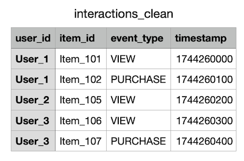
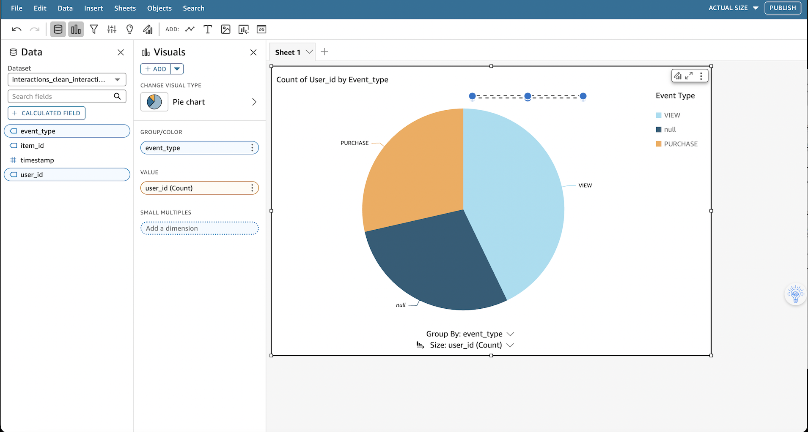
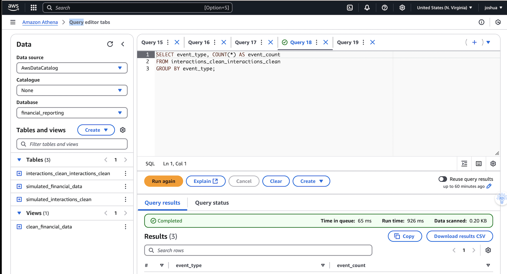

Cloud-Based Finance & Business Intelligence System (AWS)
A serverless AWS pipeline that transforms raw retail interaction and sales data into a live, interactive financial dashboard using Amazon Athena, AWS Glue, Amazon S3, and Amazon QuickSight.

📊 Project Overview
This project simulates a Finance & Business Intelligence (BI) system for a retail enterprise. It ingests customer interaction and sales data into AWS, applies automated schema detection, runs SQL-based analytics, and presents the results in a live dashboard.

The architecture is cost-effective, fully serverless, and scalable to real-world enterprise use cases such as:

Retail sales monitoring

Customer behavior analysis

Financial KPI tracking

Real-time operational insights

🧱 Architecture

*This diagram shows the entire pipeline: data ingestion into Amazon S3, schema detection with AWS Glue, SQL querying via Amazon Athena, and visualization with Amazon QuickSight. Optional modules such as Amazon Forecast and API Gateway are included for future scaling.*

Pipeline Steps
Data Ingestion – Upload raw interaction & sales CSV files to Amazon S3.

ETL & Cataloging – AWS Glue Crawler scans S3, detects schema, and stores metadata in the Glue Data Catalog.

Query Layer – Amazon Athena queries the dataset with SQL, enabling joins, aggregations, and filtering.

Visualization Layer – Amazon QuickSight builds dynamic KPI dashboards, charts, and drill-down reports.

🗃️ Dataset Example
A cleaned dataset (interactions_clean.csv) stored in S3 contains the following structure:

user_id	item_id	event_type	timestamp
User_1	Item_101	VIEW	1744260000
User_1	Item_102	PURCHASE	1744260100
User_2	Item_105	VIEW	1744260200
User_3	Item_106	VIEW	1744260300
User_3	Item_107	PURCHASE	1744260400

The screenshot shows the dataset after being processed by AWS Glue and queried in Athena, confirming that the schema was detected correctly.

🔍 Athena SQL Queries
1. Count Events by Type

This query aggregates the number of customer interactions (VIEW and PURCHASE) to provide a quick breakdown of engagement.

sql
Copy
Edit
SELECT event_type, COUNT(*) AS event_count
FROM interactions_clean_interactions_clean
GROUP BY event_type;
2. Preview First 10 Rows

  
*Athena query previewing the first 10 rows of the dataset. This step validates schema mapping and data quality before running deeper analytics.*

sql
Copy
Edit
SELECT * FROM interactions_clean_interactions_clean
LIMIT 10;
📈 QuickSight Dashboards
Interactive Pie Chart – Event Types

  
*QuickSight pie chart showing VIEW vs PURCHASE distribution. This visualization gives marketing and sales teams a clear view of customer behavior patterns for campaign optimization.*

Main Dashboard – Filters & KPIs

  
*Main QuickSight dashboard with interactive filters (`user_id`, `event_type`) and KPI cards. Key metrics include total views, purchases, and conversion rate, helping teams drill into customer activity.*

  
*QuickSight bar chart showing event counts over time grouped by event type. Useful for spotting spikes in customer activity and aligning them with campaigns or promotions.*

🔁 ETL with AWS Glue

  
*AWS Glue Crawler configuration screen. The crawler scans the S3 bucket, detects schema changes, and updates the Glue Data Catalog so Athena always queries the latest structure.*

🧠 Advanced Enhancements

  
*Planned future AWS enhancements for the BI system, including:*
- *Sales forecasting with Amazon Forecast*
- *Real-time ingestion with API Gateway + Lambda*
- *Natural language queries with QuickSight Q*
- *Advanced predictive analytics and personalization*

✅ Summary Table
Layer	AWS Service
Storage	Amazon S3
ETL	AWS Glue Crawlers
SQL Engine	Amazon Athena
Visualization	Amazon QuickSight
Forecasting (opt)	Amazon Forecast
Real-time ingest	API Gateway + Lambda
User Auth (opt)	Amazon Cognito

🚀 Use Cases
Retail BI dashboards

Customer behavior analytics

Real-time sales monitoring

Cost-optimized analytics for SMEs

🏗️ AWS Services Used
Amazon S3 – Storage layer

AWS Glue – ETL and schema cataloging

Amazon Athena – Serverless SQL queries

Amazon QuickSight – Visualization and dashboards

(Optional) Amazon Forecast, Lambda, API Gateway, Cognito

📁 Repo Structure
bash
Copy
Edit
finance-bi-dashboard/
│
├── Figure1.png   # Architecture Diagram
├── Figure2.png   # Athena Table View
├── Figure3.png   # Event Count Query
├── Figure4.png   # LIMIT Query Preview
├── Figure5.png   # QuickSight Pie Chart
├── Figure6.png   # Main Dashboard
├── Figure7.png   # Bar Chart
├── Figure8.png   # Glue Crawler
├── Figure9.png   # Enhancements Plan
└── README.md

🔗 Author
Joshua Barradas
Cloud AI Researcher | AWS Solutions Builder | Retail + Finance AI
📍 Leeds, UK
📧 barradasjoshua48@gmail.com
🔗 LinkedIn
