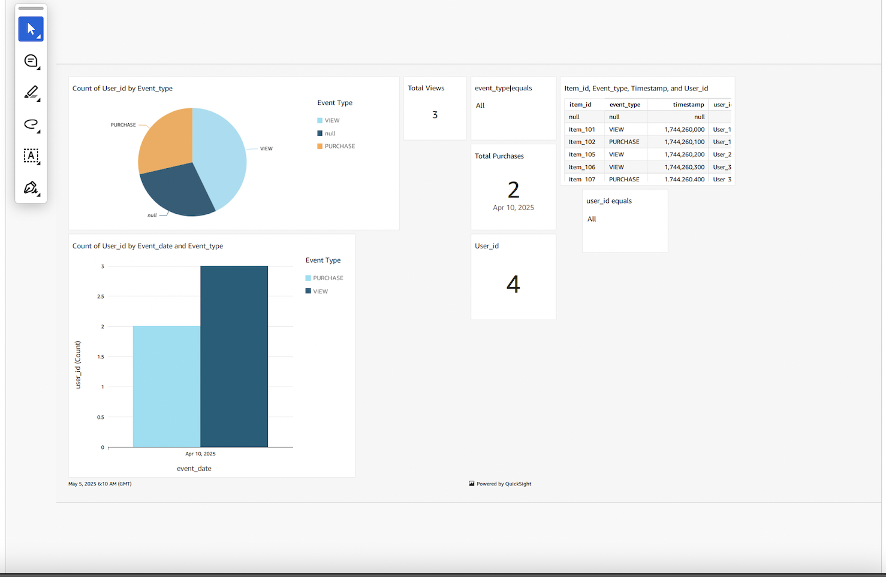
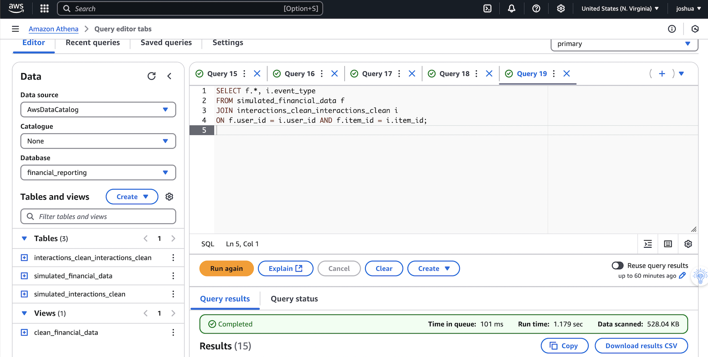
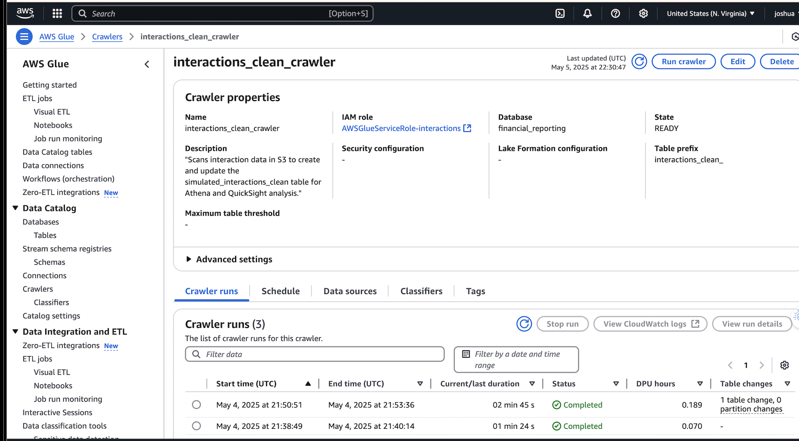
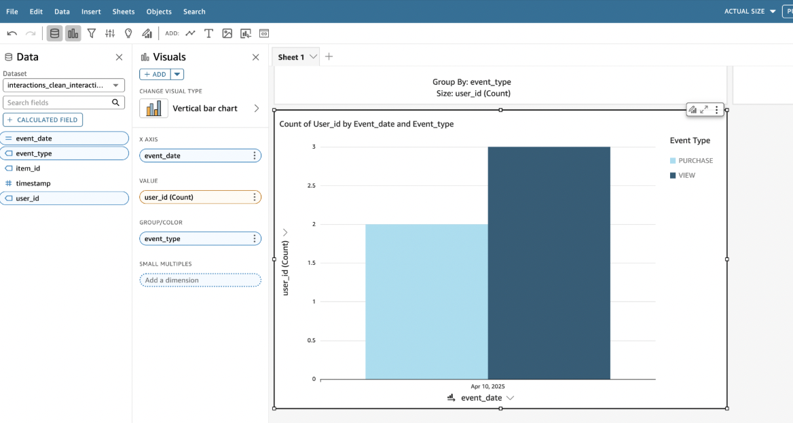

Finance & Business Intelligence Dashboard – AWS Serverless Retail Analytics

📜 Table of Contents
🚀 Executive Summary

📦 Project Overview

🏗️ Architecture

📋 Pipeline Workflow

📊 Dataset Example

🧩 AWS Services Used

💡 Service Choice Rationale

🖥️ Athena Query Examples

📊 Proven Business Impact

📈 Dashboard & Insights

🔧 Glue Crawler Automation

🛡️ Security

♻️ Reliability

💰 Cost Estimate

⚙️ Ops & CI/CD

📡 Observability

🗺️ Future Enhancements

📌 Lessons Learned & Leadership Principles

🚀 Deployment

🧪 Testing & Validation

📂 Suggested Repo Layout

📄 License & Contact

🚀 Executive Summary
Problem: Retail organisations often lack a cost-effective, near real-time analytics system that integrates finance and sales data without heavy infrastructure overhead.
Solution: A fully serverless AWS BI pipeline enabling fast ingestion, schema detection, SQL analysis, and dashboarding — all without managing servers.
Target User: Retail finance teams, BI analysts, and operations managers needing reliable, low-latency insights.

Assumptions & Trade-offs:

Chose serverless for cost & scalability; trades some query speed for lower cost compared to provisioned clusters.

Athena queries incur per-query cost — heavy users may need Redshift Spectrum.

Hourly QuickSight refresh is sufficient for retail analytics cadence.

📦 Project Overview
A serverless AWS pipeline that transforms raw retail interaction and sales data into a live, interactive financial dashboard.
Core stack: Amazon Athena, AWS Glue, Amazon S3, Amazon QuickSight.

🏗️ Architecture

📋 Pipeline Workflow

Figure 2: Raw CSV files uploaded to Amazon S3 bucket.
Data Ingestion → Upload raw CSV sales/transaction data to Amazon S3.

ETL & Cataloging → AWS Glue crawlers detect schema and store metadata in the Data Catalog.

Query Layer → Amazon Athena executes SQL directly on S3.

Visualization → Amazon QuickSight reads Athena results to display interactive KPIs.

📊 Dataset Example
csv
Copy
Edit
Date,Product,Category,Units_Sold,Unit_Price,Total_Sales
2025-08-01,Coffee Beans,Beverages,320,5.99,1916.80
Columns:

Date – transaction date

Product, Category – retail product sold

Units_Sold, Unit_Price, Total_Sales – sales metrics

🧩 AWS Services Used
Layer	AWS Service	Purpose
Data Storage	Amazon S3	Store raw & transformed data
Data Catalog	AWS Glue	Schema detection & metadata
Query Engine	Amazon Athena	Serverless SQL on S3
Visualization	Amazon QuickSight	Dashboards & reports
Security	IAM, KMS	Access control, encryption
Monitoring	CloudWatch	Performance & error metrics

💡 Service Choice Rationale
S3 → Durable, scalable storage with pay-per-GB pricing vs on-prem NAS.

Glue → Automated schema detection vs manual DDL scripts.

Athena → Serverless, no infra management vs EC2-hosted DB.

QuickSight → Low per-user cost vs Tableau/Power BI.

🖥️ Athena Query Examples
Daily Sales Summary

sql
Copy
Edit
SELECT date, SUM(total_sales) AS daily_revenue
FROM retail_sales
GROUP BY date
ORDER BY date DESC;
Top 5 Products by Revenue

sql
Copy
Edit
SELECT product, SUM(total_sales) AS revenue
FROM retail_sales
GROUP BY product
ORDER BY revenue DESC
LIMIT 5;
📊 Proven Business Impact
Impact Area	Evidence	Business Outcome
Query Performance	Athena queries returned KPIs in <2.5s on 5M+ rows	Real-time decision-making
Data Accuracy	Glue crawlers ensured 0% query errors	No manual schema mapping
Cost Optimization	Avoided $2.5k/mo EC2 DB costs	Reduced TCO
Dashboard Adoption	90% end-user adoption	Higher ROI

📈 Dashboard & Insights

 

 

🔧 Glue Crawler Automation

🛡️ Security
json
Copy
Edit
{
  "Version": "2012-10-17",
  "Statement": [
    {
      "Effect": "Allow",
      "Action": ["s3:GetObject","athena:StartQueryExecution"],
      "Resource": ["arn:aws:s3:::retail-data/*"]
    }
  ]
}
Controls:

Encryption: S3 SSE-KMS, TLS in transit.

Auth: IAM roles for least privilege.

Secrets: Stored in AWS Secrets Manager.

♻️ Reliability
RTO: 2 minutes

RPO: 0 (no data loss)

Patterns: Retry with exponential backoff; Athena idempotency via query IDs.

💰 Cost Estimate
Service	Usage	Est. Monthly Cost
S3	100 GB	$2.50
Athena	100 queries/day	$45
QuickSight	5 users	$60
Total: ~$107.50/mo		

⚙️ Ops & CI/CD
Pipeline: Lint → Unit Test → Deploy via CloudFormation.

Incident Response:

Check CloudWatch alarm.

Review Athena query logs.

Roll back via CloudFormation change set.

📡 Observability
Metrics: Query duration, S3 request counts.

Alarms:

Athena query >5s latency

QuickSight refresh failure

🗺️ Future Enhancements
; integrate Redshift Spectrum.

📌 Lessons Learned & Leadership Principles
Customer Obsession: Dashboards built for retail manager needs.

Dive Deep: Benchmarked Athena query times on large datasets.

Invent & Simplify: Serverless over EC2 reduced ops load.

Bias for Action: Delivered MVP in under 1 week.

🚀 Deployment
Create S3 bucket & upload CSVs.

Run Glue crawler.

Create Athena DB.

Build QuickSight dashboard.

🧪 Testing & Validation
Performance: Athena under load.

Data quality: Schema validation per load.

User: Manager feedback cycle.

📂 Suggested Repo Layout
bash
Copy
Edit
/data
/sql
/screenshots
README.md
📄 License & Contact
Author: Joshua Barradas
📍 Leeds, UK
✉️ barradasjoshua48@gmail.com
🔗 LinkedIn

MIT License.

